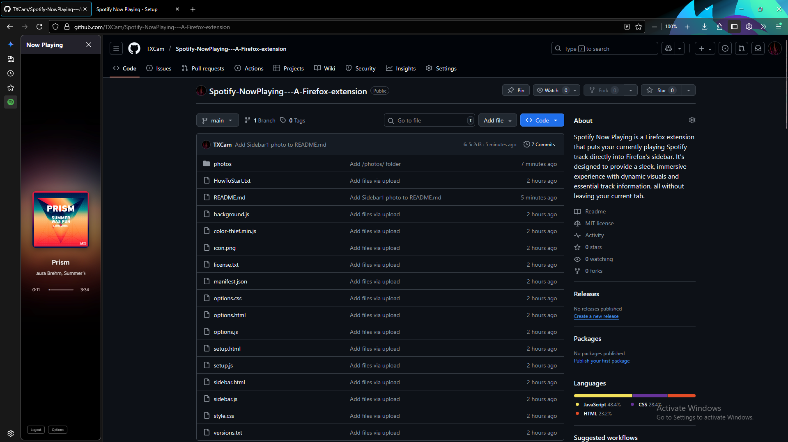
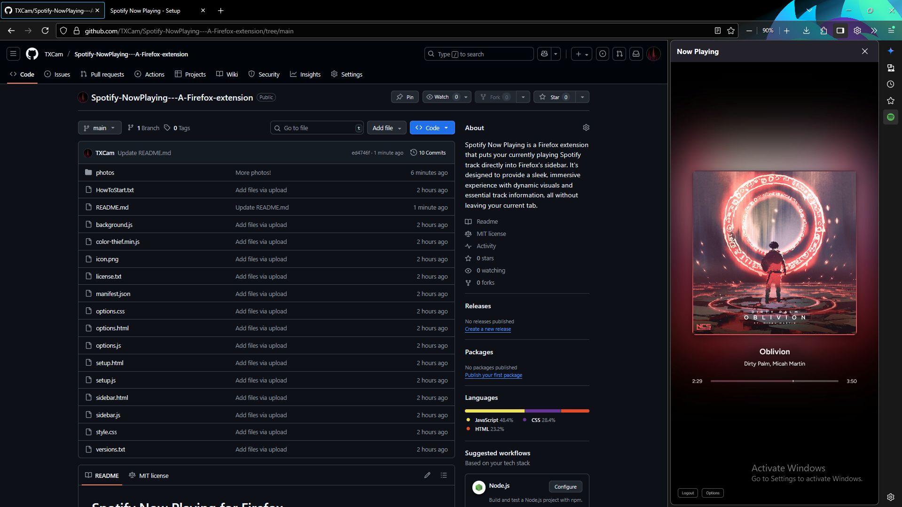
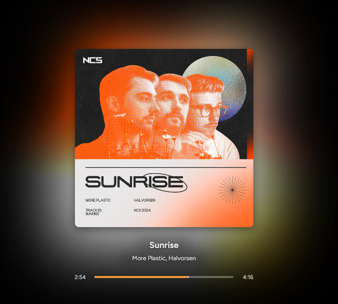
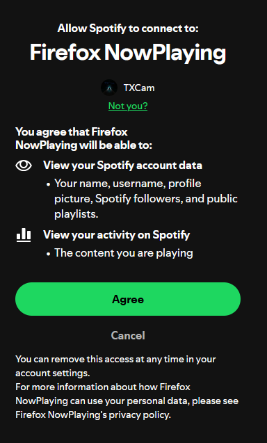
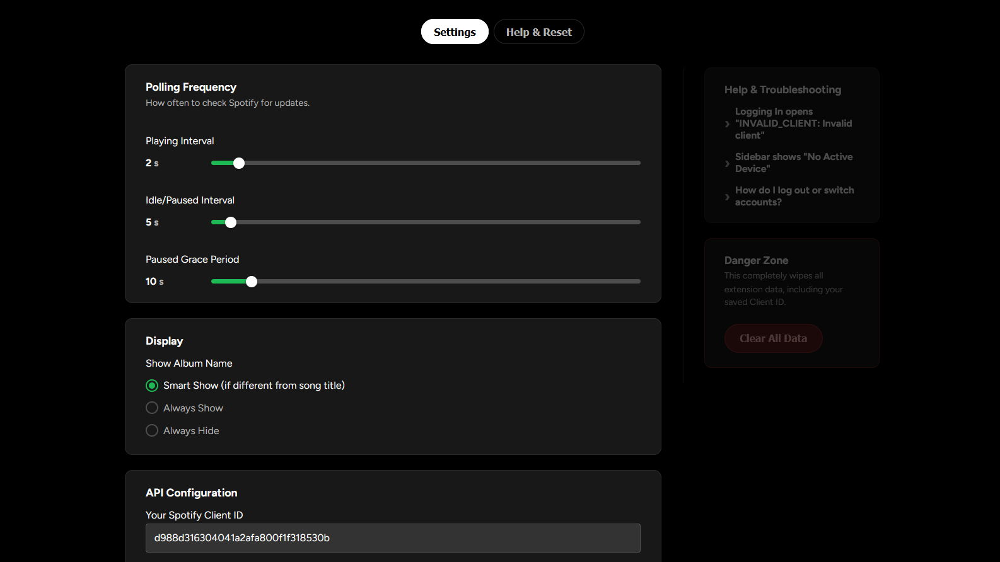
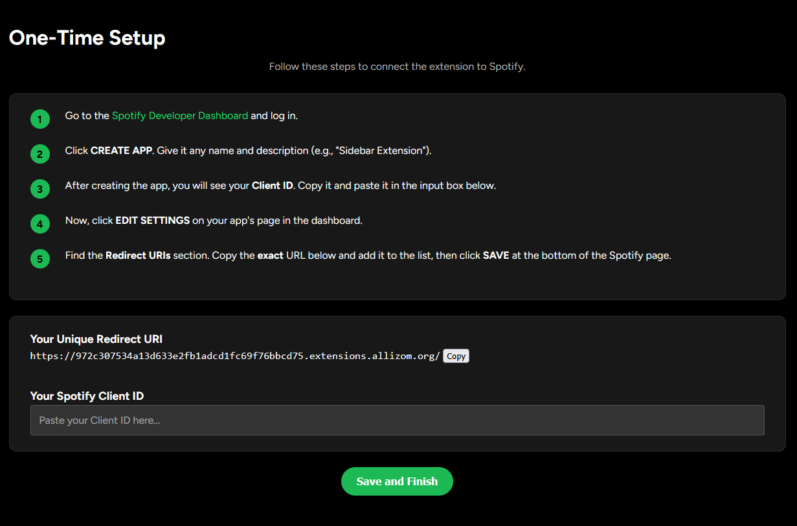

# Spotify Now Playing for Firefox

Spotify Now Playing is a Firefox extension that puts your currently playing Spotify track directly in your browser's sidebar. It's designed to provide a sleek, immersive experience with dynamic visuals and essential track information, all without leaving your current tab.

---

---

## Features

- **Sleek User Interface**: Features a clean, minimal design with an animated progress bar, smooth fade transitions between songs, and ambient background blur that dynamically matches the album art.  
- **Dynamic Visuals**: The progress bar's color matches the album art, and the song title and artist text will automatically scroll with a marquee animation if they overflow.  
- **Interactive Controls**: Click the song title to open the track in Spotify. When paused, the album art and text dim for a visual cue.  
- **Secure Authentication**: Uses the modern and secure PKCE OAuth 2.0 flow for a safe login experience.  
- **Smart Polling**: Optimizes performance by intelligently refreshing track information less frequently when the music is idle or paused.  
- **Customizable Settings**: An options page allows you to adjust polling frequency, grace period, and album name visibility.  
- **User-Friendly Setup**: Includes a dedicated setup page to guide you through the process of connecting your Spotify account and obtaining a Client ID.  

---

## Installation & Setup (Temporary Add-on)

This guide is for loading the extension as a temporary add-on. I know there looks like a lot of steps, but they go by pretty quickly and easily.

1. Open Firefox and navigate to `about:debugging`.  
2. In the left-hand menu, click on **This Firefox**.  
3. Click the **Load Temporary Add-on...** button.  
4. Navigate to the directory where the extension files are stored and select the `manifest.json` file.
5. The extension will now appear in your sidebar. A setup page will automatically open \(otherwise open it from the sidebar).
6. Follow the directions in the Setup Page. You'll have to make a Spotify Developer account and Custom App.
7. Paste your ClientID into the setup page.
8. Copy your Unique Redirect URI from Setup
9. Go to your [Spotify Developer Dashboard](https://developer.spotify.com/dashboard/) and select your application.  
10. Go to the **Edit Settings** page for your application.  
11. Under the **Redirect URIs** section, paste the decoded URI you found in step 8.  
12. Click **Save and Finish**.  
13. Go back to the extension sidebar in Firefox and click **Login** again.  
14. This time, you'll be prompted to allow the application. After you do, it will connect correctly.  

Enjoy!

---

## Troubleshooting

If you encounter issues, here are some common solutions:

- **Login Loop**: Usually caused by an invalid Client ID or incorrect Redirect URI. Double-check the setup instructions, ensuring the Redirect URI matches exactly.  
- **Stale Information**: If the track isn't updating, check your polling frequency settings on the Options page, or try re-logging in.  
- **General Issues**: Use the **Clear All Data** button on the Options page to reset local storage and resolve persistent issues.  

---

## Known Issues

- **Fast Marquee**: The marquee animation for overflowing text can move a bit too fast.  
- **Marquee doesn't always work**: Clicking Marquee won't always open it in Spotify

---

## Future Plans

- Lyrics integration.
- Pop-out player view with Always-On-Top functionality.
- Caching of the last known song.
- More resilient refresh token handling to prevent frequent logouts.
- Improved error screens.
- User-adjustable color customization.
- Tooltips explaining each setting option. 

---

